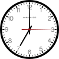

# Clock

## [Digital Version](https://jmsmarcelo.github.io/Clock/digital.html)

 

- **🎞️ How I made:** ...

## [Analog Version](https://jmsmarcelo.github.io/Clock/analog.html)

 

- **🎞️ How I made:** ...

---
- *In JavaScript, SVG/Vector and HTML*
